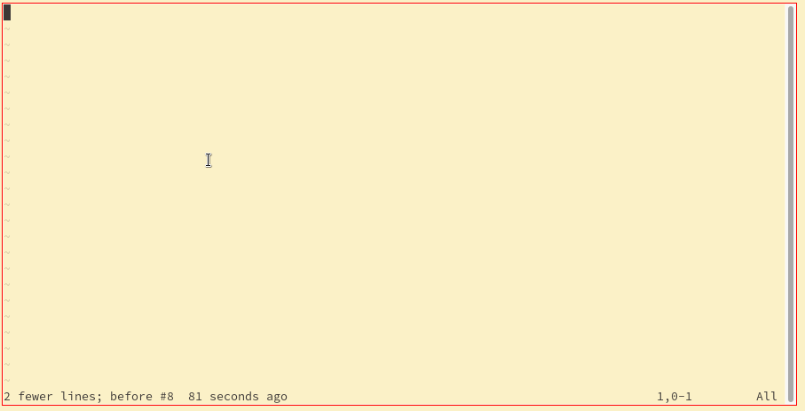
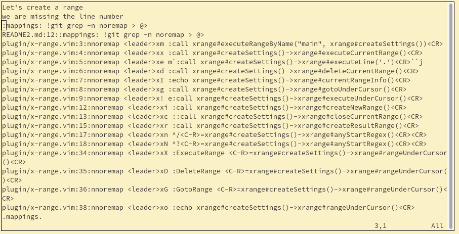
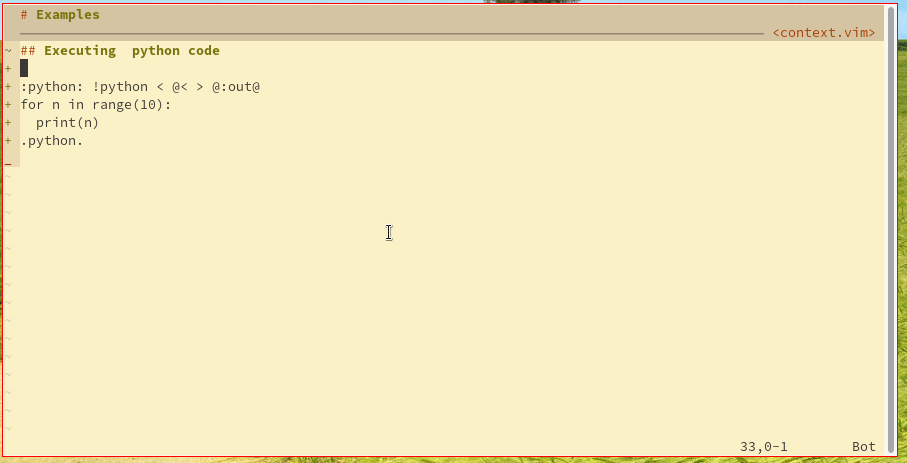

# Overview
X-range is a plugin allowing to execute source code within text documents.
 It can run part of a buffer, process it through an external shell command and inject the result somewhere else in the buffer. It attempts to be an alternative to [Emacs org-babel](https://orgmode.org/worg/org-contrib/babel/).

The main use cases are 
  - to store local macros in a buffer. Such macros can for example, launch tests, and modify the buffer itself, to generate and keep up to date a table of content
  - to use a vim buffer as a REPL by evaluting code in different languages and collecting the results in the same buffer. This is sometimes called [reproductible research'](https://en.wikipedia.org/wiki/Reproducibility#Reproducible_research) as is in [Emacs org-babel](https://orgmode.org/worg/org-contrib/babel/) or [Jupyter Notebook](https://jupyter.org/)


## Examples
### Grep mappings
To grep all the mapping commands in this plugin (to update the DOC for examplE)



``` vimscript
:mappings: +ar > +x !git grep noremap > @>
.mappings.
```

We can jump to actual buffer/line by pressing `gF`.


### Reading errors
To fill the quickfix list with the result of the grep, we need to replace the output `@>` with `@@`



``` vimscript
:mappings_errors: !git grep -n noremap > @@
.mappings_errors.
``` 

### Executing  python code

Here we execute the content of then range `python` and inject the result in the `python:out`.


``` vimscript
:python: !python < @< > @:out@
  for n in range(10):
    print(n)
.python.
```

`!python < @< > @:out@` is actually just vim script.
`@<` and `@:out@` are actually shorthand `@python<` and `@python:out@` which are then replaced by temporary files name.
X-Range take care of creating, writing and reading the temporary files.


# Usage
## Ranges
The core idea behing X-Range are ranges. A range associate a name to continous set of lines and optional tags.
Ranges can be executed, expanded to normal vim range, or read and written from to a temporary file.

### Range defintions
TODO
### Range expansion
TODo
### Range execution
TODO
## Tags
### Tags
TODO
### Tags expansion
TODO
 
## Default Mappings
TODO
# Configuration
TODO
##  auto exec
## main
